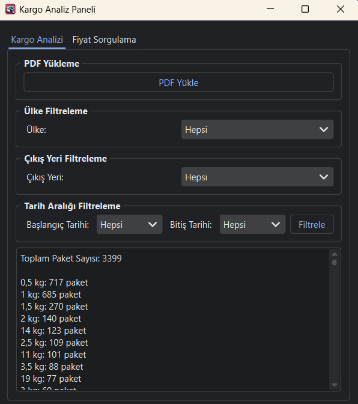
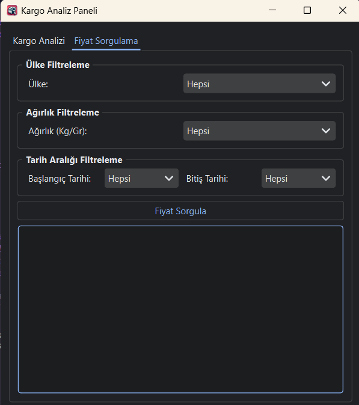

# Cargo Analysis Panel

The Cargo Analysis Panel is a desktop application developed to perform detailed analysis of shipping information from PDF files, utilizing PyQt6 and pdfplumber libraries. It allows users to examine the weight distribution of shipments, analyze country-wise distribution, and conduct detailed queries with specific filters.




## Features

- Extract shipping information from PDF files
- Filter by country and departure location
- Filter by specific date ranges
- Analyze weight distributions of shipments
- Calculate shipping costs in USD

## Getting Started

This section guides you on how to get a copy of the project up and running on your local machine for development and testing purposes.


### Installation

Install the required libraries using pip:

```bash
pip install -r requirements.txt
```

### Running the Application

Start the application with the following command:

```bash
python main.py
```

## Usage

After launching the application, use the "Load PDF" button to upload the PDF file you wish to analyze. Then, utilize the provided filtering options to narrow down and analyze the data.

## Contributing

Contributions are welcome! For major changes, please open an issue first to discuss what you would like to change.

Please make sure to update tests as appropriate.

## License

This project is licensed under the MIT License - see the [LICENSE.md](LICENSE.md) file for details.
